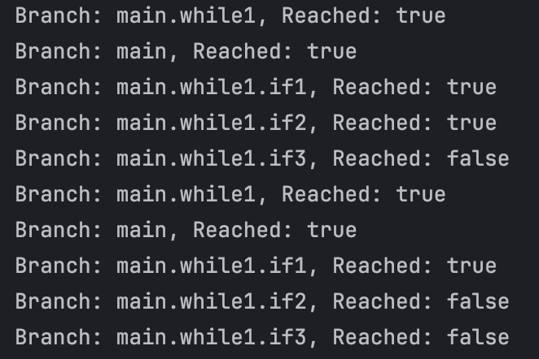
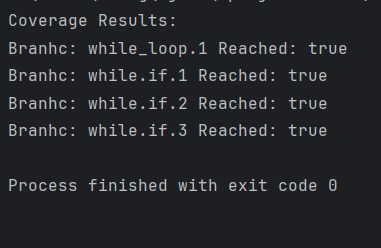
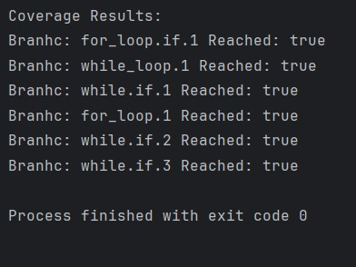
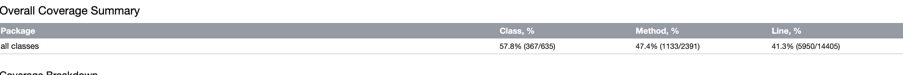

# Report for Assignment 1

## Project chosen

Name: Java Algorithms

URL: (Our own) https://github.com/cz23in/algorithms (Original) https://github.com/TheAlgorithms/Java

Number of lines of code and the tool used to count it: 40601 counted with CLOC

Programming language: Java

## Coverage measurement

### Existing tool

The existing tool that was executed is JaCoCo. It was executed using Maven with the following command:
```sh
mvn clean test jacoco:report
```


the coverage results provided by the existing tool is generated in the target/site/jacoco directory.


### Your own coverage tool

<The following is supposed to be repeated for each group member>

<Group member name>

<Function 1 name>

<Show a patch (diff) or a link to a commit made in your forked repository that shows the instrumented code to gather coverage measurements>

<Provide a screenshot of the coverage results output by the instrumentation>

<Function 2 name>

<Provide the same kind of information provided for Function 1>

Adam Atchia

```HowManyTimesRotated.rotated```

https://github.com/cz23in/algorithms/commit/cf4db03aff7a10914858adac5313b8dd874c6117




Rui Gao

Function 1 name: findKthMax
[Function 1 commit](https://github.com/cz23in/algorithms/commit/28ed48d52d7253c67a2eb2cabfb395d8b56355de#diff-da29792920db2b60923338a5dfb1aa3ffc49101330eeec20554be3f4cfcf8735
)
<p align="left">
  
</p>

<Function 2 name>
[Function 2 commit](https://github.com/cz23in/algorithms/commit/715b924ffc16042cfdb923cd9af57a175c8fccc4#diff-da29792920db2b60923338a5dfb1aa3ffc49101330eeec20554be3f4cfcf8735)
<p align="left">
  
</p>

<Provide the same kind of information provided for Function 1>


## Coverage improvement

### Individual tests

<The following is supposed to be repeated for each group member>

<Group member name>

<Test 1>

<Show a patch (diff) or a link to a commit made in your forked repository that shows the new/enhanced test>

<Provide a screenshot of the old coverage results (the same as you already showed above)>

<Provide a screenshot of the new coverage results>

<State the coverage improvement with a number and elaborate on why the coverage is improved>

<Test 2>

<Provide the same kind of information provided for Test 1>

Adam Atchia

Test 1: ```testHowManyTimesRotated```



To work on

### Overall

<Provide a screenshot of the old coverage results by running an existing tool (the same as you already showed above)>

<Provide a screenshot of the new coverage results by running the existing tool using all test modifications made by the group>

## Statement of individual contributions

<Write what each group member did>
