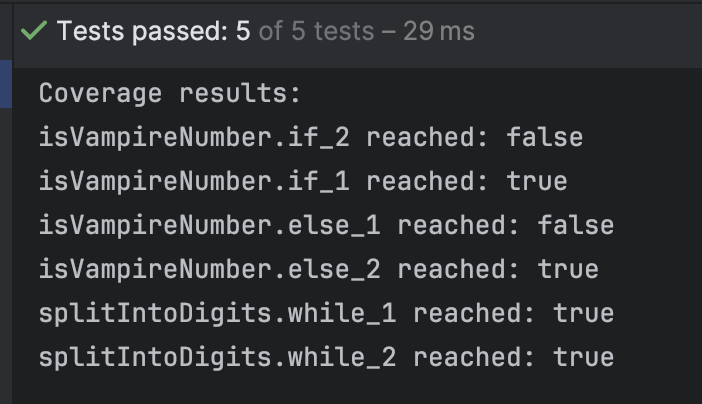
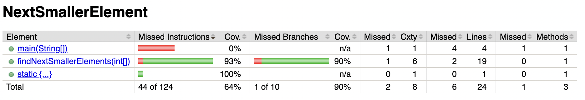

# Report for Assignment 1

## Project chosen

Name: Java Algorithms

URL: (Our own) https://github.com/cz23in/algorithms (Original) https://github.com/TheAlgorithms/Java

Number of lines of code and the tool used to count it: 40601 counted with CLOC

Programming language: Java

## Coverage measurement

### Existing tool

The existing tool that was executed is JaCoCo. It was executed using Maven with the following command:
```sh
mvn clean test jacoco:report
```


the coverage results provided by the existing tool is generated in the target/site/jacoco directory.


### Your own coverage tool

#### Adam Atchia

```UnionFind.union```

https://github.com/cz23in/algorithms/commit/edb11906d30e593c1f0e19ac5f7192e9107e5c61


```NextSmallerElement.findNextSmallerElements```

https://github.com/cz23in/algorithms/commit/d7648dcc9e7969a5000e19f8e5c5308e34ccc59a


### Rui Gao

**Function 1 name:** ```findKthMax```

[Function 1 commit](https://github.com/cz23in/algorithms/commit/28ed48d52d7253c67a2eb2cabfb395d8b56355de#diff-da29792920db2b60923338a5dfb1aa3ffc49101330eeec20554be3f4cfcf8735
)
<p align="left">
  
</p>

**Function 2 name:** ```partition```

[Function 2 commit](https://github.com/cz23in/algorithms/commit/715b924ffc16042cfdb923cd9af57a175c8fccc4#diff-da29792920db2b60923338a5dfb1aa3ffc49101330eeec20554be3f4cfcf8735)
<p align="left">
  
</p>

### Ciaran Edmundson

**Function 1 name:** ```isVampireNumber```

[Function 1 commit](https://github.com/cz23in/algorithms/commit/3fa27f267f77cb0c682ac41743f391970dd958fa)

<p align="left">
  
</p>

**Function 2 name:** ```splitIntoDigits```

[Function 2 commit](https://github.com/cz23in/algorithms/commit/3fa27f267f77cb0c682ac41743f391970dd958fa)
<p align="left">
  
</p>

### Xueqi Zhang

**Function 1 name:** ```isKeith```

[Function 1 commit](https://github.com/cz23in/algorithms/commit/dddcef57e62ab9909a1361555f40260343cac512)
<p align="left">
  
</p>

**Function 2 name:** ```partition```

[Function 2 commit](https://github.com/cz23in/algorithms/commit/dddcef57e62ab9909a1361555f40260343cac512)
<p align="left">
  
</p>


## Coverage improvement

### Individual tests

<The following is supposed to be repeated for each group member>

<Group member name>

<Test 1>

<Show a patch (diff) or a link to a commit made in your forked repository that shows the new/enhanced test>

<Provide a screenshot of the old coverage results (the same as you already showed above)>

<Provide a screenshot of the new coverage results>

<State the coverage improvement with a number and elaborate on why the coverage is improved>

<Test 2>

<Provide the same kind of information provided for Test 1>

#### Adam Atchia

Test 1: ```UnionFind.union```

https://github.com/cz23in/algorithms/commit/2b06f4043370ff777fa9b1e55df55761c4f412c5

Before:


After:


From a visual inspection of the before and after screenshots, a 5% improvement in method coverage is observed as well as a 3% improvement in line coverage.

These are attributed to no existing test cases being present and a test case being added.


Test 2: ```NextSmallerElement.findNextSmallerElements```

https://github.com/cz23in/algorithms/commit/6699363f58cc2be2a44d61c439f9e2f0110f6139

Before:


After:


From a visual inspection of the before and after screenshots, a 2% improvement in method coverage is observed as well as a 7% improvement in line coverage.

These are attributed to no existing test cases being present and a test case being added.

### Rui Gao

**Test 1:** ```findKthMax```

[Test 1 commit](https://github.com/cz23in/algorithms/commit/bdfeed89be8b4cd83bf16d55ae7e3df51ad87d3b#diff-7f9d72a70005fcd19f4aff8afc3f568d6004e859b926c528181e9e9cc23c3f52)
<p align="left">
  
</p>
<p align="left">
  
</p>

The initial branch coverage was 0%, since there were no tests. After adding new test cases, the branch coverage of `findKthNumber` function is 100%.

`findKthMax` Method Branches:
1. **While Loop**:
    - The while loop is covered by all test cases that call `findKthMax` with a non-empty array.

2. **If Conditions**:
    - `if (k == pivot)`: Covered by `testFindKthMax_KEqualPivot_ReturnResult` where `k` equals the pivot index.
    - `else if (k > pivot)`: Covered by `testFindKthMax_KGreaterThanPivot_UpdatesStart` where `k` is greater than the pivot index.
    - `else`: Covered by `testFindKthMax_KLessThanPivot_UpdatesEnd` where `k` is less than the pivot index.

3. **Edge Cases**:
    - Negative `k`: Covered by `testFindKthMax_KOutOfBoundsNegative_ReturnsNegativeOne`.
    - `k` out of bounds: Covered by `testFindKthMax_KOutOfBoundsGreaterThanLength_ReturnsNegativeOne`.
    - Empty array: Covered by `testFindKthMax_EmptyArray_ReturnsNegativeOne`.
    - Single element: Covered by `testFindKthMax_SingleElementArray_ReturnsElement`.

**Test 2:** ```partition```

[Test 2 commit](https://github.com/cz23in/algorithms/commit/73176bb742580da64c740d725919cfa8c68feb81)
<p align="left">
  
</p>
<p align="left">
  
</p>

The initial branch coverage was 0%, since there were no tests. After adding new test cases, the branch coverage of `partition` function is 100%.

`partition` Method Branches:
1. **For Loop**:
    - The for loop is covered by `testPartition_ValidArray_CorrectPartitioning`.

2. **If Condition**:
    - `if (nums[i] < pivot)`: Covered by the same test case, ensuring the partition logic is validated.


### Ciaran Edmundson

**Test 1:** ```isVampireNumber```

[Test 1 commit](https://github.com/cz23in/algorithms/commit/9dec24942ae6bf86262d8b731bfd891427943140)
<p align="left">
  
</p>
<p align="left">
  
</p>

There was no branch coverage as there were no automated test cases. After adding new cases, the branch coverage of `isVampireNumber` function shows as 83%.

`isVampireNumber` Method Branches:
1. **First if Condition** (`noPseudoVamireNumbers`):

This branch is covered by the `testIsVampireNumber_NoPseudoVampireNumbers_True` and `testIsVampireNumber_NoPseudoVampireNumbers_False` test cases.

2. **Second if Condition** `(a * 10 <= b || b * 10 <= a)`:

This branch is specifically covered by the `testIsVampireNumber_HitInnerIf` test case, which provides inputs that satisfy the condition `a * 10 <= b || b * 10 <= a`.

3. **Return true/false:**

The return paths are validated by multiple test cases, ensuring both true and false results are handled correctly:
`testIsVampireNumber_False`
`testIsVampireNumber_NoPseudoVampireNumbers_True`
`testIsVampireNumber_NoPseudoVampireNumbers_False`
`testIsVampireNumber_HitInnerIf`

**Test 2:** ```splitIntoDigits```

[Test 1 commit](https://github.com/cz23in/algorithms/commit/9dec24942ae6bf86262d8b731bfd891427943140)
<p align="left">
  
</p>
<p align="left">
  
</p>

There was no branch coverage as there were no automated test cases. After adding new cases, the branch coverage of `splitIntoDigits` function shows as 100%.

`splitIntoDigits` Method Branches:
1. **While Loops** `(while num > 0 and while num2 > 0)`:

The loops are covered by the `testSplitIntoDigits` test case

2. **Extra** 
All test cases for isVampireNumber except `testIsVampireNumber_HitInnerIf` cover this function as well, as it calls it.
### Overall

<Provide a screenshot of the old coverage results by running an existing tool (the same as you already showed above)>

<Provide a screenshot of the new coverage results by running the existing tool using all test modifications made by the group>

## Statement of individual contributions
**Ciaran Edmundson**
1. Branch Coverage Instrumentation: 
   - Added branch coverage instrumentation to the VampireNumber class. I added a `coverageMap` datastructure and 2 functions`printCoverage()`, `resetCoverage()` to ensure all branches were tracked.
2. Test Case Development: 
   - Created test cases to ensure branches within the `isVampireNumber` and `splitIntoDigits` functions were covered.
3. Coverage Reporting: 
   - Implemented functions to print and and reset coverage, to ensure the map is reset between each test. (other team members did it differently)
4. Existing Coverage Tool
   - I initially experimented with Intellij's built in coverage tool, which doesn't show branch coverage by default so I had to figure that out. I then switched to Jacoco as it shows individual function coverage compared to Intellij's

   
   <Write what each group member did>
